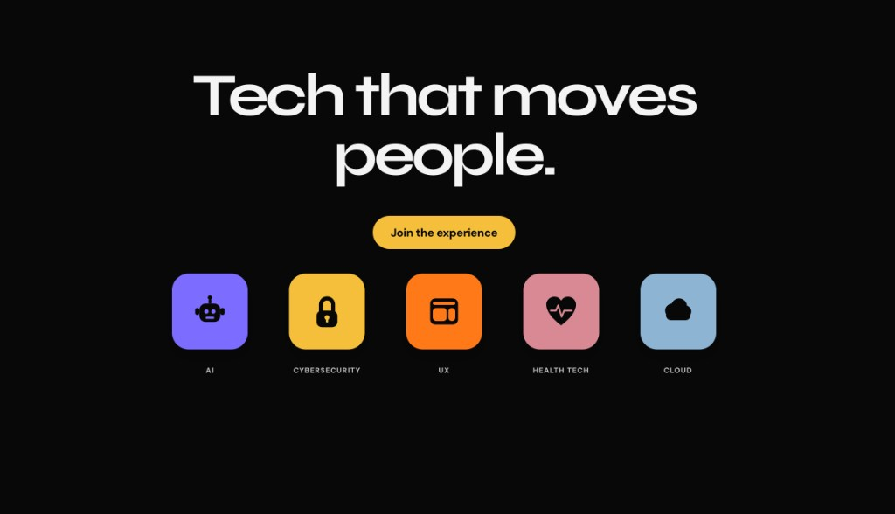

  

<h1 align="center">Bmore Tech Nights</h1>

  The site for Baltimore builders, career changers, founders, creatives, and tech-curious people who want a room after work.

  <a href="https://www.bmoretechnights.com">bmoretechnights.com</a>

  
  

  

## Why it exists

Bmore Tech Nights brings those people together after work, and in the stretch between events. The site is one page. The night itself is on [Luma](https://luma.com/techfolx).

## What you see

Open [bmoretechnights.com](https://www.bmoretechnights.com).

- The headline is “Tech that moves people.”
- **Join the experience** opens the Luma calendar.
- Five fields sit under the button: AI, Cybersecurity, UX, Health Tech, and Cloud.
- Scrolling reveals three lines about Baltimore and the people building it, then “Step inside.” with the same Luma link.
- **Sound on** plays the room audio.

The scroll is set in type. Words come forward as you move down the page.

Built with Next.js, React, TypeScript, and Tailwind CSS.

Built by [Khalif Cooper](https://www.khalifcooper.dev).
